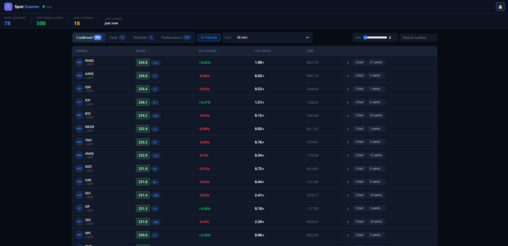
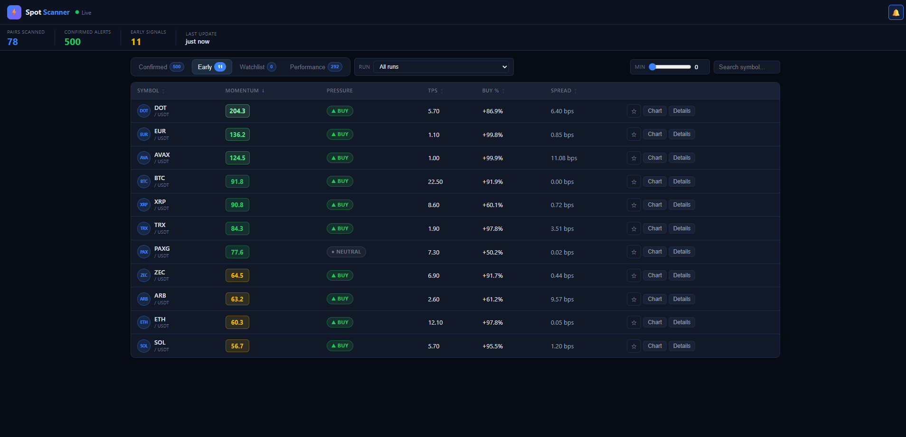
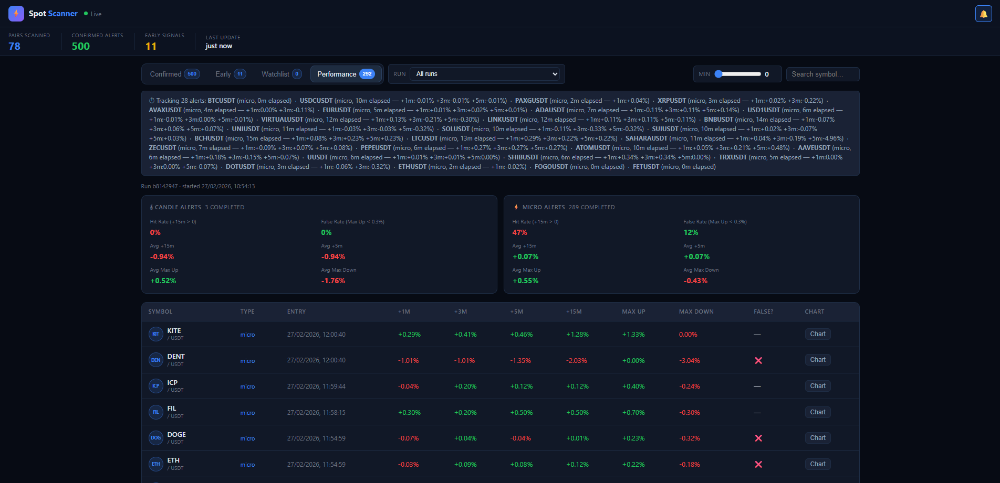

# Spot Scanner

A real-time Binance spot momentum scanner with a live web dashboard. Streams trade flow, order-book ticks, and 5-minute klines for the top 200 USDT pairs simultaneously and surfaces two types of signal:

[](https://deno.land/)
[](LICENSE)
[]()

- **Confirmed alerts** — candle-based: abnormal 5m volume (≥ 3× the 1h average) combined with a price move ≥ 1.5%.
- **Early signals** — micro-momentum: trade-per-second z-score, cumulative volume delta (CVD) rate, buy ratio, and spread compression scored continuously every 5 seconds.







---

## Features

- Monitors up to 200 USDT spot pairs ranked by 24 h quote volume
- WebSocket streams: `kline_5m`, `aggTrade`, `bookTicker` (optional `depth`)
- Chunked stream management — auto-reconnect, per-type connection diagnostics
- Normalized 0–100 scoring for both signal types
- Live dashboard auto-refreshes every 7 s via `/alerts` polling
- Sortable columns, symbol search, min-score slider
- Watchlist pinned to `localStorage`
- Sound alerts (Web Audio API) and toast notifications for new confirmed alerts
- Expandable detail rows and mobile card layout
- 1-minute TradingView chart for early signals, 5-minute for confirmed
- Run selector to filter dashboard data by run ID
- Performance false-rate flagging (max up < 0.3%)
- CLI flags for port, pairs limit, and dashboard-only mode
- `/health` endpoint with per-stream uptime diagnostics
- Compiles to a single self-contained binary (Deno)
- Strict symbol validation against Binance spot whitelist

---

## Requirements

[Deno](https://deno.com) 1.40 or later.

```sh
# macOS / Linux
curl -fsSL https://deno.land/install.sh | sh

# Windows (PowerShell)
irm https://deno.land/install.ps1 | iex
```

---

## Quick start

```sh
deno run --allow-net --allow-run --allow-read scanner.ts
```

The dashboard opens automatically at `http://localhost:8000/dashboard`.

> **First run:** the scanner bootstraps 13 × 5m candles for every pair before streaming starts (~10–15 s). The Early signals tab shows a warming-up message for the first ~60 s while the trade-flow baseline fills.

---

## CLI options

| Flag | Default | Description |
|---|---|---|
| `--port <n>` | `8000` | HTTP port |
| `--pairs-limit <n>` | `200` | Max USDT pairs to scan |
| `--dashboard-only` | off | Serve dashboard without live scanning |
| `--version` | — | Print version and exit |
| `--help` | — | Print usage and exit |

```sh
# Lighter run for testing
deno run --allow-net --allow-run --allow-read scanner.ts --pairs-limit 50

# Different port
deno run --allow-net --allow-run --allow-read scanner.ts --port 9000

# Inspect the UI without the scanner running
deno run --allow-net --allow-run --allow-read scanner.ts --dashboard-only
```

---

## Compile to a binary

Bundles `scanner.ts` and `dashboard.html` into a single executable — no Deno installation needed on the target machine.

### All platforms at once (recommended)

Double-click `compile_all.bat` on Windows, or run the equivalent commands manually. It produces four binaries in one go:

| Output file | Platform |
|---|---|
| `scanner-windows-x64.exe` | Windows x64 |
| `scanner-linux-x64` | Linux x64 |
| `scanner-macos-x64` | macOS Intel |
| `scanner-macos-arm64` | macOS Apple Silicon |

### Single platform

```sh
# Windows
deno compile --allow-all --include dashboard.html --output scanner-windows-x64.exe --target x86_64-pc-windows-msvc scanner.ts

# Linux
deno compile --allow-all --include dashboard.html --output scanner-linux-x64 --target x86_64-unknown-linux-gnu scanner.ts

# macOS Intel
deno compile --allow-all --include dashboard.html --output scanner-macos-x64 --target x86_64-apple-darwin scanner.ts

# macOS Apple Silicon
deno compile --allow-all --include dashboard.html --output scanner-macos-arm64 --target aarch64-apple-darwin scanner.ts
```

### Running the binary

```sh
./scanner-linux-x64                          # Linux
./scanner-macos-arm64                        # macOS Apple Silicon
scanner-windows-x64.exe                     # Windows
scanner-windows-x64.exe --port 9000 --pairs-limit 100
```

---

## Docker (compiled binary)

This setup runs the compiled Linux binary and persists logs in a named volume.

```sh
docker compose up -d --build
```

Ports can be overridden via `PORT` in `docker-compose.yml`.

---

## API endpoints

| Endpoint | Description |
|---|---|
| `GET /dashboard` | Live HTML dashboard |
| `GET /alerts` | JSON snapshot (alerts + early candidates) |
| `GET /runs` | Run metadata grouped by run ID |
| `GET /health` | Uptime, per-stream connection counts and reconnect counts |
| `GET /` | Redirects to `/dashboard` |

### `/health` response shape

```json
{
  "status": "ok",
  "started_at": "2025-01-01T00:00:00.000Z",
  "uptime_s": 3600,
  "watched_symbols": 200,
  "last_events": {
    "kline": "2025-01-01T01:00:00.000Z",
    "aggtrade": "2025-01-01T01:00:00.000Z",
    "bookticker": "2025-01-01T01:00:00.000Z",
    "scan": "2025-01-01T01:00:00.000Z"
  },
  "streams": {
    "kline":       { "connected": 3, "reconnects": 0 },
    "aggTrade":    { "connected": 3, "reconnects": 0 },
    "bookTicker":  { "connected": 3, "reconnects": 0 },
    "depth":       { "connected": 0, "reconnects": 0 }
  },
  "alerts_count": 12,
  "candidates_count": 47
}
```

---

## Configuration

Key constants at the top of `scanner.ts`:

| Constant | Default | Description |
|---|---|---|
| `TOP_PAIRS_LIMIT` | `200` | Pairs to monitor (overridden by `--pairs-limit`) |
| `MIN_24H_QUOTE_VOLUME_USDT` | `5,000,000` | Minimum 24 h volume to include a pair |
| `ABNORMAL_VOLUME_MULTIPLIER` | `3` | Volume spike threshold (× 1h average) |
| `ABNORMAL_PRICE_CHANGE_PERCENT` | `1.5` | Minimum 5m price move to confirm alert |
| `ALERT_COOLDOWN_MS` | `15 min` | Per-symbol cooldown after a confirmed alert |
| `MICRO_CANDIDATE_SCORE` | `50` | Min momentum score to appear in Early tab |
| `MICRO_TRIGGER_SCORE` | `72` | Score that triggers a REST confirmation check |
| `MICRO_TRIGGER_COOLDOWN_MS` | `45 s` | Per-symbol cooldown on trigger checks |
| `SCORE_INTERVAL_MS` | `5,000` | How often momentum scores are recalculated |
| `ENABLE_DEPTH_IMBALANCE` | `false` | Enable order-book depth stream (extra bandwidth) — see note below |

> **Depth stream note:** `ENABLE_DEPTH_IMBALANCE` is `false` by default, so the `/health` endpoint will always show `"depth": { "connected": 0, "reconnects": 0 }`. This is normal — no depth WebSockets are opened until you set it to `true`. Enabling it adds an order-book imbalance component (up to 20 points) to early signal scores but opens one extra WebSocket chunk per 80 symbols.

---

## How signals are scored

### Confirmed alerts (0–100)

```
volScore   = clamp(log2(volumeRatio) × 20, 0, 65)
priceScore = clamp(priceChange5m × 6,      0, 35)
score      = volScore + priceScore
```

A minimum trigger (3× volume + 1.5% move) scores ~41. A strong spike (10× volume + 5% move) scores ~95.

### Early signals (0–100+)

Scored every 5 s from a rolling 60-second trade-flow baseline:

| Component | Weight |
|---|---|
| TPS z-score (trades per second vs baseline) | up to 108 |
| CVD z-score (net buy notional vs baseline) | up to 96 |
| Buy ratio above 50% | up to 24 |
| Spread compression vs baseline | up to 20 |
| Recent 10 s notional (log scale) | up to 16 |

Signals above `MICRO_TRIGGER_SCORE` (72) trigger a REST call to verify the move hasn't already blown its top before being promoted to a confirmed alert.

---

## File structure

```
scanner.ts           — Deno backend: streaming, scoring, HTTP server
dashboard.html       — Frontend dashboard (served from scanner.ts)
compile_scanner.bat  — Windows build script (current platform only)
compile_all.bat      — Windows build script (all four platform targets)
LICENSE              — MIT licence
```

---

## License

MIT — see [LICENSE](LICENSE) for the full text.
